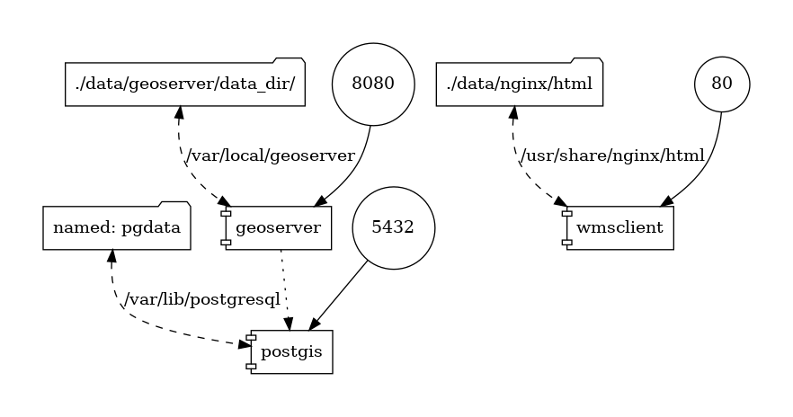

# osm-geoserver-postgis
Docker-compose that assembles the necessary components to implement a Geoserver instance that publishes the OpenStreetMap (OSM) layers locally on a single host/machine (Postgis is required to store the OSM layers).

Instructions for this project are based on this repository [OSM-Styles](https://github.com/geosolutions-it/osm-styles), but making a simpler execution plan.

The steps and scripts are intended to run in the context of Linux/Mac environments. TO-DO: Windows.

## Steps

With the scripts that are included in the folder we have simplified the steps to deploy a solution that includes a Geoserver instance publishing the OSM layers (stored in a Postgis), using WMS service.

This simplification will work fine when deployment is done on the same host (on which the docker-compose that initializes the system will be executed). If you have to deploy on more than one host, you have to consider some technical aspects (basically, the same as moving from docker-compose to swarm or kubernetes, so you will have to adapt it).

The idea is to keep the use case simple (below is the diagram of containers and volumes to create).

The steps are:

1. Install [git](https://github.com/git-guides/install-git), [docker](https://docs.docker.com/engine/install/ubuntu/) y [docker-compose](https://docs.docker.com/compose/install/) on the host machine.

2. Download the repository of this project.

   a. **git clone https://github.com/geotekne/osm-geoserver-postgis.git**

3. Download the OSM files per country/region from the [GeoFabrik](https://download.geofabrik.de/) portal (PBF extension files) that you want to import into the Postgis instance (these files keep the high-resolution vector information/detail), and **place them in the ./osm-geoserver-postgis/pbfs** folder found in the git repository.

   a. Example:  **wget https://download.geofabrik.de/south-america-latest.osm.pbf**

4. Run the command **./startup.sh** (note: this command initializes the docker container instances, downloads the modified low-resolution OSM data file (*see footnote), imports the PBF files from step 3 in the PostGIS database and once imported it moves them to the ./osm-geoserver-postgis/pbfs/imported folder). **IMPORTANT: ensure that mapped ports (80, 8080 and 5432) in your host are available and free to use.**

   a.  **./osm-geoserver-postgis/startup.sh**

Observations :

- OSM Data reset: Every time the docker-compose is initialized, it is validated if there are files to import in the PBFs folder, and the information of the OSM layers is reset. Only in the case of having the folder empty, that is to say without PBF files, is that the existing information is not reset.
- In case you want to add new PBFs keeping the information already imported, it is suggested to copy those files that have already been imported (/pbfs/imported folder) to the ./pbfs folder so that the new data layers are accumulated together with the previous ones. Then, you will need to stop docker-compose (./osm-geoserver-postgis/shutdown.sh) and restart with ./startup.sh .
- The steps mentioned in the previous paragraph will force a reinitialization of the OSM instance (leaving it inactive). Although it is not the ideal situation, it is the simplest way to explain the steps to be executed. Optionally, the user can check the scripts (./startup.sh and ./imposm/import-pg.sh) which provide more detail on how to do the same job without affecting system availability.

(*) The initial version of this file comes from this repository https://github.com/geosolutions-it/osm-styles (in the README you will find the link to download it from Dropbox), but it has errors/imperfections in certain areas - product of the treatment to lower the resolution - that have been corrected.

## Technical Details

- One instance of each service
- Images used
  - geoserver: geotekne/geoserver:lime-2.16.2
    - The docker-compose defines the use of the CSS and Pregeneralized features plugins to render the OSM layers accordingly.
    - TO-DO: the mentioned image is based on kartoza/geoserver, which has the mentioned plugins embedded, but that leads to a docker image of size equal to 1.9 GB (which is too much). The next improvement is to generate a new version of geoserver:lime that includes the necessary plugins and no more than that.
  - postgis: kartoza/postgis:12.1
    - Used to store the OSM layers.
  - wmsclient: nginx:1.21.3-alpine
    - That shows in a simple example, an html+css+js web application, the access to live OSM data or to the OSM in local instance that we have created. Accessible via browser at http://localhost:80
- Geoserver data volume mapped to folder on host
- Postgis data volume mapped to pgdata volume in docker
- Wmsclient data volume mapped to folder containing the sample web application.
- Ports mapped on host:
  - geoserver: 8080
  - postgis: 5432
  - wmsclient:80

## Diagram

